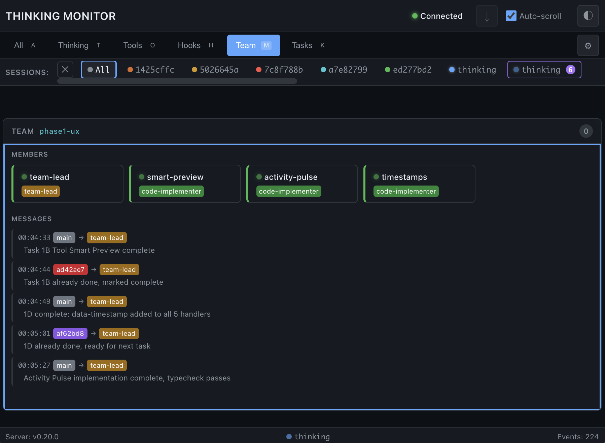
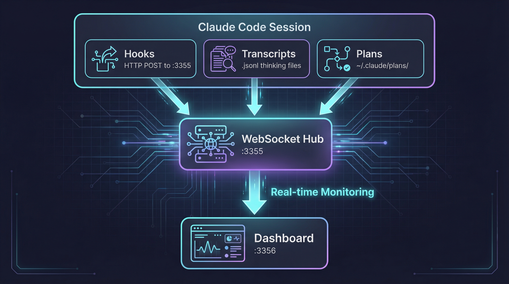

# Thinking Monitor

**See inside Claude's mind.**

[](https://www.typescriptlang.org/)
[](https://nodejs.org/)
[](./CHANGELOG.md)

A real-time dashboard that visualizes Claude Code's thinking process, tool usage, and agent activity as it happens.



---

## Why

Claude Code is powerful, but opaque. You see the output, not the process. Thinking Monitor changes that—watch Claude reason through problems, track every tool call, and understand how agents coordinate in real-time.

---

## Features

| Panel | What You See |
|-------|--------------|
| **Thinking** | Live stream of Claude's reasoning with collapsible entries |
| **Tools** | Every tool call with timing, inputs, and outputs |
| **Todo** | Task progress (pending → in-progress → completed) |
| **Plan** | Active plan files with quick-open and reveal |

**Plus:**
- Single-column vertical layout with resizable panels
- Session filtering across all panels
- Keyboard shortcuts for everything
- Collapsible panels with drag-to-reorder
- Right-click to open files in editor or Finder
- Secret redaction (API keys, tokens, passwords)
- GFM markdown table rendering

---

## Quick Start

```bash
# Clone and install
git clone https://github.com/jwtor7/thinking.git
cd thinking
pnpm install

# Register hooks with Claude Code
./scripts/setup.sh --install

# Start the monitor
pnpm dev
```

Open **http://localhost:3356** and start a Claude Code session. Watch the magic.

---

## How It Works



---

## Configuration

### Environment Variables

| Variable | Default | Options |
|----------|---------|---------|
| `LOG_LEVEL` | `info` | `debug` · `info` · `warn` · `error` |

```bash
LOG_LEVEL=warn pnpm start   # Quiet
LOG_LEVEL=debug pnpm start  # Verbose
```

### Setup Commands

```bash
./scripts/setup.sh --install    # Register hooks
./scripts/setup.sh --uninstall  # Remove hooks
./scripts/setup.sh --status     # Check status
```

---

## Keyboard Shortcuts

| Key | Action |
|-----|--------|
| `a` `t` `o` `d` `p` | Switch view (All, Thinking, Tools, Todo, Plan) |
| `Shift` + `t` `o` `d` `p` | Collapse/expand panel |
| `c` | Clear all entries |
| `s` | Toggle auto-scroll |
| `/` | Focus search |
| `Cmd+O` | Open selected plan |
| `Cmd+Shift+R` | Reveal plan in Finder |

---

## Security

- **Localhost only** — binds to `127.0.0.1`, not exposed to network
- **No persistence** — events exist only in memory
- **Secret redaction** — API keys, tokens, passwords automatically masked
- **Path validation** — file access restricted to `~/.claude/`
- **XSS prevention** — all content HTML-escaped before render
- **CSP headers** — Content-Security-Policy for defense-in-depth XSS protection
- **CSRF protection** — Origin header validation on file action requests

---

## Requirements

- Node.js ≥ 22
- pnpm
- Claude Code CLI

---

## Recent Changes

- **v0.16.3** (2026-01-10) — File browser in export modal, save .md files anywhere
- **v0.16.2** (2026-01-10) — Export as Markdown: save sessions as formatted `.md` files via header button or `Cmd+E`
- **v0.16.1** (2026-01-10) — Bug fixes: session bar overflow, Reveal in Finder CSP/CORS issues, tooltip errors
- **v0.16.0** (2026-01-10) — Session Display Upgrade: folder names, activity-based pulsing, tooltips, context menu, status bar indicator
- **v0.15.7** (2026-01-10) — Hooks panel enabled by default
- **v0.15.6** (2026-01-10) — Cleanup: removed Playwright artifacts, fixed hook health check (~10ms vs ~1s)
- **v0.15.5** (2026-01-08) — Session-aware UI: hide Todo/Plan tabs in All sessions, hide collapse in single view

*[Full changelog →](./CHANGELOG.md)*
