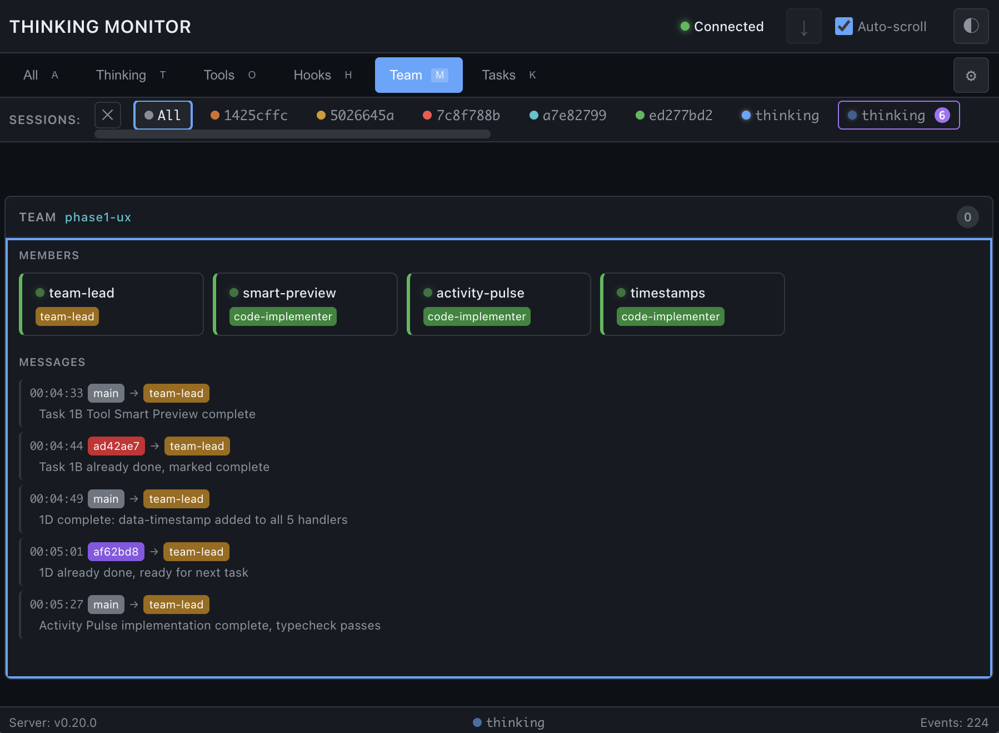
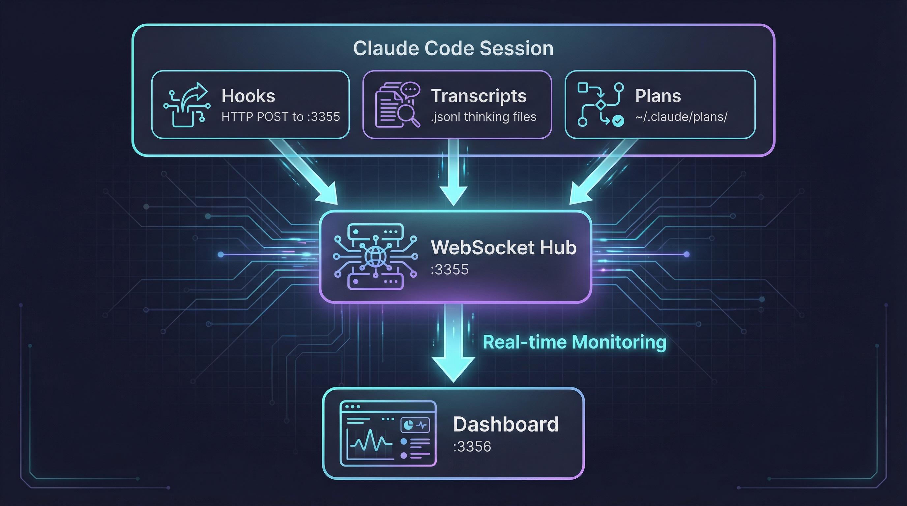

# Thinking Monitor

**See inside Claude's mind.**

*A research instrument for visualizing AI coding assistant reasoning, tool calls, hook lifecycle, and multi-agent coordination in real time. Built to make agent behavior observable enough to govern, audit, and debug.*

[](#status-on-hold)
[](./LICENSE)
[](https://www.typescriptlang.org/)
[](https://nodejs.org/)
[](./CHANGELOG.md)
[](https://www.canada.ca/)
[](https://github.com/jwtor7/thinking)

> ## Status: On Hold
>
> This repository is paused, not abandoned. The questions it was built to investigate, including visibility into AI agent reasoning, tool calls, and inter-agent coordination at runtime, are still live, and I am still working on them, in different shapes, in my current research.
>
> In the meantime, I've been running with autonomous agent harnesses like [Hermes](https://hermes-agent.nousresearch.com/) from Nous Research. A note on that: I'm comfortable operating this way because I have years of hands-on experience reading agent behavior, recognizing failure modes, and intervening when something looks wrong. Running agents autonomously without that background is a meaningfully different risk profile. Treat my setup as a researcher's choice, not a general recommendation.
>
> Fork freely if any of this code is useful to you.



---

## Why this exists

Organizations are deploying AI coding assistants (Claude Code, GitHub Copilot, Cursor) that execute with elevated privileges: modifying source code, running terminal commands, accessing credentials, and making API calls on behalf of the developer. Unlike traditional software, these systems make autonomous decisions in real time based on reasoning that is invisible to the security teams responsible for the environments they run in.

Thinking Monitor was built to close that visibility gap. It captures the full trace of an AI agent's activity (reasoning, tool calls, hook lifecycle events, sub-agent delegation) and presents it as a real-time, filterable dashboard. The intent is to make agentic behavior observable enough that humans can govern it, auditors can review it, and developers can debug it.

---

## Research context

This project sits at the intersection of three active conversations in Canadian and global AI security:

- **AI agent governance and trust frameworks**: OWASP Agentic Top 10, NIST AI Risk Management Framework, ISO/IEC 23894 (AI risk management), ISO/IEC 42001 (AI management systems)
- **Zero-trust architecture for autonomous systems**: localhost-only binding, no persistence, tamper-evident audit trails, hook-based policy enforcement at the runtime boundary
- **Secure-by-default tooling for AI-assisted software development**: secrets redaction, prompt and tool-output sanitization, chain-of-custody for agent actions

The patterns this project explored, including tamper-evident logging of agent tool calls, policy enforcement at the agent runtime boundary, and secrets redaction in prompt and tool-output pipelines, have informed how I now architect agent deployments in client environments. The dashboard itself is paused; the design language is not.

---

## Who this is for

| Stakeholder | What they get |
|-------------|---------------|
| **Software development teams** | Visibility into AI assistant behavior without sacrificing velocity; faster debugging of agent missteps |
| **Security operations** | Real-time event stream of AI activity that can be inspected, exported, or routed into existing SIEM workflows |
| **Compliance and audit** | A defensible record of what an agent did, when, on which files, and with which tools |
| **Researchers** | A reference implementation for instrumenting agentic AI and a substrate for studying agent behavioral patterns |
| **AI vendors and platform teams** | A reference architecture for building trustworthy agent runtime observability |

---

## Features

| Panel | What You See |
|-------|--------------|
| **Thinking** | Live stream of Claude's reasoning with collapsible entries |
| **Tools** | Every tool call with timing, inputs, and outputs |
| **Plan** | Active plan files with quick-open and reveal |
| **Team** | Unified collaboration view: members, hierarchy, session-scoped agent list/thinking detail, and inter-agent messages |
| **Tasks** | Three-column kanban board (Pending / In Progress / Completed) with task cards |
| **Timeline** | Unified chronological feed across all event types with type icons and agent badges |

**Plus:**
- Nested agent hierarchy tree with click-to-filter
- Per-agent event filtering across all panels
- Cross-panel linking (click to navigate between related entries)
- Hook PRE+POST grouping (merges paired hook events)
- Tab count badges showing live event counts
- Single-view panel layout with collapsible sections
- Session filtering across all panels
- Stable default `pnpm dev` startup path with optional `pnpm dev:watch` hot-reload mode
- Keyboard shortcuts for everything
- Collapsible panels with drag-to-reorder
- Right-click to open files in editor or Finder
- Secret redaction (API keys, tokens, passwords)
- GFM markdown table rendering
- Stats bar with top tools, duration percentiles, and event rate
- Global search (Cmd+K) across all panels

---

## Quick Start

```bash
# Clone and install
git clone https://github.com/jwtor7/thinking.git
cd thinking
pnpm install

# Register hooks with Claude Code
./scripts/setup.sh --install

# Start the monitor
pnpm dev
```

Open **http://localhost:3356** and start a Claude Code session. Watch the magic.

---

## How It Works



Thinking Monitor hooks into Claude Code's lifecycle events. When Claude Code runs, it fires hooks at key moments (before and after tool calls, when thinking blocks are produced, when agents start and stop), and those hooks POST JSON events to a local server on port 3355.

The server validates, redacts secrets from, and broadcasts each event over WebSocket to any connected dashboard clients. The dashboard (served on port 3356) renders events in real time across its seven panels, giving you a live view of everything Claude is doing.

A separate transcript watcher polls Claude Code's session files for thinking blocks and other data that hooks don't capture, ensuring comprehensive coverage of the AI's activity.

---

## Configuration

### Environment Variables

| Variable | Default | Options |
|----------|---------|---------|
| `LOG_LEVEL` | `info` | `debug` · `info` · `warn` · `error` |

```bash
LOG_LEVEL=warn pnpm start   # Quiet
LOG_LEVEL=debug pnpm start  # Verbose
```

### Setup Commands

```bash
./scripts/setup.sh --install    # Register hooks
./scripts/setup.sh --uninstall  # Remove hooks
./scripts/setup.sh --status     # Check status
```

---

## Keyboard Shortcuts

| Key | Action |
|-----|--------|
| `l` `t` `o` `a` `h` `p` `k` `m` | Switch view (Timeline, Thinking, Tools, Team alias, Hooks, Plan, Tasks, Team) |
| `Shift` + `l` `t` `o` `a` `h` `m` `k` | Collapse/expand panel (Timeline, Thinking, Tools, Team alias, Hooks, Team, Tasks) |
| `Shift+P` | Open panel visibility settings |
| `c` | Clear all entries |
| `s` | Toggle auto-scroll |
| `/` | Focus search |
| `Cmd+K` | Global search |
| `Cmd+O` | Open selected plan |
| `Cmd+Shift+R` | Reveal plan in Finder |

---

## Security

Thinking Monitor is **localhost-only by design**. It binds exclusively to `127.0.0.1` and is never exposed to the network. All data stays on your machine.

- **No persistence**: events exist only in memory during the session
- **Secret redaction**: API keys, tokens, and passwords are automatically masked before display
- **Path validation**: file operations are restricted and normalized to prevent traversal
- **XSS prevention**: all content is HTML-escaped before rendering
- **CSP headers**: Content-Security-Policy for defense-in-depth protection
- **CSRF protection**: Origin header validation on all mutating requests
- **Rate limiting**: protects against local denial-of-service

See [SECURITY.md](./SECURITY.md) for vulnerability reporting.

---

## Requirements

- Node.js ≥ 22
- pnpm
- Claude Code CLI

### Platform Support

| Platform | Status | Notes |
|----------|--------|-------|
| **macOS** | Fully supported | Primary development platform |
| **Linux** | Fully supported | All features work natively |
| **Windows** | Partial | Server and dashboard work via Node.js. Shell scripts (`setup.sh`, `mock-data.sh`) require WSL or Git Bash. File-open actions use `explorer /select,` natively. |

The core server uses cross-platform Node.js APIs (`path.join`, `os.homedir`) throughout. Windows users can run the dashboard and server without issues; the main gap is that hook installation and utility scripts are bash-only.

---

## Contributing

The project is on hold (see the [Status](#status-on-hold) note at the top of this README), so I'm not actively reviewing pull requests right now. If you fork this and build something interesting, open an issue or reach out, I would like to hear about it. For development setup and the original PR guidelines, see [CONTRIBUTING.md](./CONTRIBUTING.md).

---

## About the author

Junior Williams is a Principal Enterprise Architect working at the intersection of cybersecurity and AI. He holds CISSP, GCIH, CCSK, GSEC, and SSCP certifications, and serves on the Standards Council of Canada Mirror Committees for ISO/IEC JTC 1/SC 42 (Artificial Intelligence) and SC 27 (Information security, cybersecurity and privacy protection), contributing to the development of international standards in both domains.

Prior work includes the "Williams' Law" paper on exponential AI advancement through algorithmic innovation (published via Zenodo), enterprise security roadmaps aligned with PCI DSS, ISO/IEC 27001, and NIST CSF, and vCISO engagements for critical-infrastructure clients. Based in Toronto.

---

## Disclaimer

Thinking Monitor is an **unofficial community tool**. It is not affiliated with, endorsed by, or supported by Anthropic. Use at your own risk. This software is provided as-is with no warranty; see the [LICENSE](./LICENSE) for details.

---

## License

[MIT](./LICENSE), Copyright (c) 2025-2026 Junior Williams

---

## Recent Changes

- **2026-05-24 18:09**: Project status reframed from "Deprecated" to "On Hold"; README expanded with research-context framing, stakeholder table, and author bio; repo hygiene cleanup (untracked files already in .gitignore).
- **v1.8.1** (2026-03-30 00:21): Task view fix: UUID session resolution, empty dir suppression, completion log from task_update events, session-scoped filtering, correct peak metric, header count, ID display in completions.
- **v1.8.0** (2026-03-29 16:50): Tasks and Teams view redesign: Tasks replaced kanban with compact active-work rows + completion log with duration pills; Teams replaced 4 sections with agent lifecycle Gantt strip, NxN communication heat matrix, and enhanced message filtering.

*For complete history, see [CHANGELOG.md](./CHANGELOG.md)*
